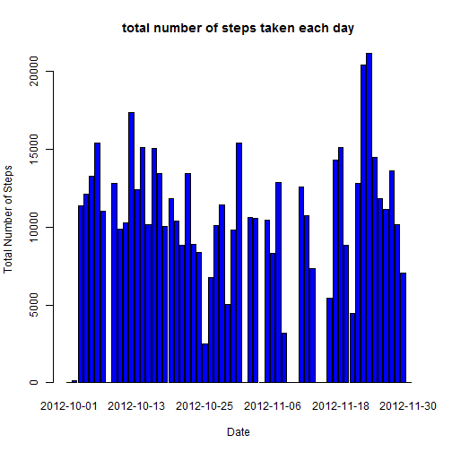
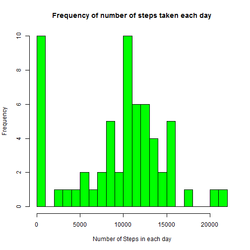
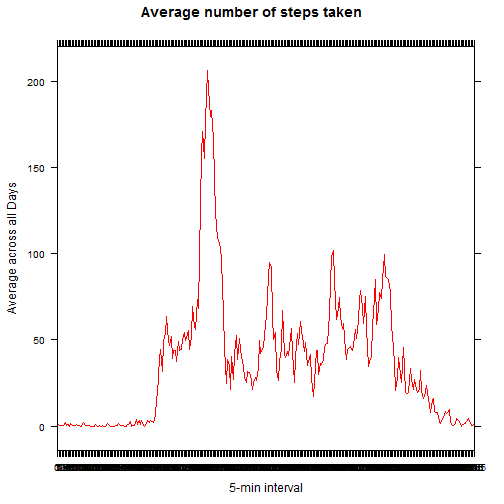
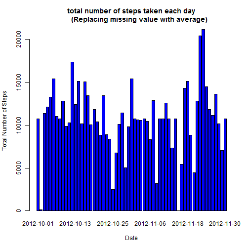
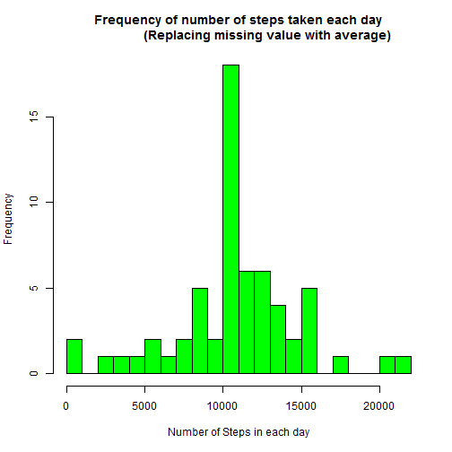
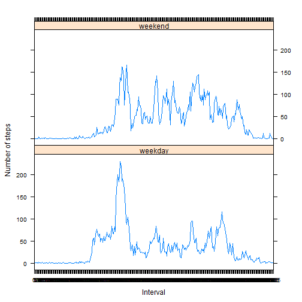

[1]: https://d396qusza40orc.cloudfront.net/repdata%2Fdata%2Factivity.zip. "Dataset"

[2]: http://www.fitbit.com/ "Fitbit"

[3]: http://www.nike.com/us/en_us/c/nikeplus-fuelband "Nike Fuelband"

[4]: https://jawbone.com/up "Jawbone Up"

It is now possible to collect a large amount of data about personal movement using activity monitoring devices such as a [Fitbit][2], [Nike Fuelband][3], or [Jawbone Up][4]. These type of devices are part of the "quantified self" movement.

This assignment makes use of data from a personal activity monitoring device. This device collects data at 5 minute intervals through out the day. The data consists of two months of data from an anonymous individual collected during the months of October and November, 2012 and include the number of steps taken in 5 minute intervals each day.

## Data

Click here to download the [Dataset][1]

The variables included in this dataset are:

- **steps**: Number of steps taking in a 5-minute interval (missing values are coded as NA)

- **date**: The date on which the measurement was taken in YYYY-MM-DD format

- **interval**: Identifier for the 5-minute interval in which measurement was taken

The dataset is stored in a comma-separated-value (CSV) file and there are a total of 17,568 observations in this dataset.


## Loading and pre-processing the data


```r
datap<-read.csv("activity.csv",header=TRUE)

##Changing 'factor' format of date column to 'Date' Format

datap<-transform(datap,date=as.Date(date),interval=as.factor(interval))
```


Let's load all the necessary packages in order to complete the task


```r
library(dplyr)
library(plyr)
library(lattice)
```


## What is mean total number of steps taken per day?


Let's plot a barplot for total number of steps taken per each day (that's including days when no steps has been taken).

Prior to that, we could reshape the data ignoring the NAs.


```r
temp<-aggregate(datap$steps,by=list(datap$date),FUN=sum,na.rm=TRUE)
names(temp)<-c("date","steps")

barplot(temp$steps,names.arg = temp$date ,col = "blue",xlab = "Date",ylab = "Total Number of Steps",
        main = "total number of steps taken each day")
```

 


Let's plot a histogram which could depict dispersion of number of step in each day.


```r
hist(temp$steps,breaks=20,col = "green",xlab = "Number of Steps in each day",ylab = "Frequency",
        main = "Frequency of number of steps taken each day")
```

 


We could also calculate the Mean and Median for the same.


```r
rmean<-mean(temp$steps)
rmedian<-median(temp$steps)
```


The Mean & Median of total number of steps taken per day are

- Mean: **9354.2295082** steps

- Median: **10395** steps


## What is the average daily activity pattern?


Let's make a time series plot of the 5-minute interval (x-axis) and the average number of steps taken, averaged across all days (y-axis).


```r
temp2<-setNames((aggregate(datap$steps,by=list(datap$interval),FUN=mean,na.rm=TRUE)),c("interval","steps"))

xyplot(steps ~ interval, temp2, 
       type="l", 
       lwd=1, 
       xlab="5-min interval", 
       ylab="Average across all Days",
       , main = "Average number of steps taken"
       , col = "red")
```

 

```r
maxstep<-max(temp2$steps)
maxstepinterval<-temp2$interval[temp2$steps==maxstep]
maxstep<-round(maxstep)
```


The 5-minute interval, on average across all the days in the dataset, contains the maximum number of steps is: **835**th Interval, which is having maximum: **206** total no. of steps.


## Imputing missing values


Let's calculate the total number of missing values in the dataset (i.e. the total number of rows with NAs)


```r
nummissing<-length(datap$steps[is.na(datap$steps)])
```


total number of missing values in the dataset is: **2304**


Let's fill all the missing values in the dataset with their respective avergae steps in the 5 minute interval of all days.


```r
temp4<-filter(datap,!is.na(datap$steps))

temp3<-filter(datap,is.na(datap$steps))
temp3<-join(temp3,temp2,by="interval",type="left")
temp3<-temp3[,c(4,2,3)]

datap<-rbind(temp3,temp4)
```


Let's plot a barplot for total number of steps taken per each day (that's including days when no steps has been taken).

Prior to that, we could reshape the data (Replacing missing value with average).


```r
temp5<-aggregate(datap$steps,by=list(datap$date),FUN=sum)
names(temp5)<-c("date","steps")

barplot(temp5$steps,names.arg = temp5$date ,col = "blue",xlab = "Date",ylab = "Total Number of Steps",
        main = "total number of steps taken each day
        (Replacing missing value with average)")
```

 


Let's plot a histogram which could depict dispersion of number of step in each day (Replacing missing value with average).


```r
hist(temp5$steps,breaks=20,col = "green",xlab = "Number of Steps in each day",ylab = "Frequency",
        main = "Frequency of number of steps taken each day
                (Replacing missing value with average)")
```

 

We could also calculate the Mean and Median for the same datset, replacing missing value with average.


```r
rmean2<-mean(temp5$steps)
rmedian2<-median(temp5$steps)
```


The Mean & Median of total number of steps taken per day (Replacing missing value with average) are.

- Mean: **1.0766189 &times; 10<sup>4</sup>** steps

- Median: **1.0766189 &times; 10<sup>4</sup>** steps

The Mean & Median of total number of steps taken per day (Ignoring missing value with average) are.

- Mean: **9354.2295082** steps

- Median: **10395** steps


Yes, these values do differ slightly after imputing missing data on the estimates of the total daily number of steps.


## Are there differences in activity patterns between weekdays and weekends?


Let's create a new factor variable called **'days'**, in the dataset, with two levels - "weekday" and "weekend" indicating whether a given date is a weekday or weekend day.


```r
days<-(weekdays(datap$date))

  for (i in 1:length(days)){

    if (days[i]=="Saturday" | days[i]=="Sunday"){
    
    days[i]<-"weekend"
    
    }
    else{
    days[i]<-"weekday"
    }

    i<-i+1
}

days<-as.factor(days)
datap<-cbind(datap,days)
```

Let's make a panel plot containing a time series plot of the 5-minute interval (x-axis) and the average number of steps taken, averaged across all weekday days or weekend days (y-axis).


```r
temp6<-setNames((aggregate(datap$steps~datap$interval+datap$days,FUN=mean)),c("interval","days","steps"))

xyplot(steps ~ interval | days, temp6, 
       type="l", 
       lwd=1, 
       xlab="Interval", 
       ylab="Number of steps", 
       layout=c(1,2))
```

 
